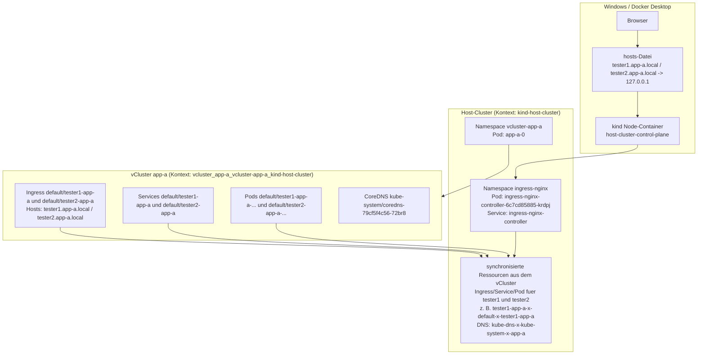

# Lokale vCluster- und Ingress-Diagramme

Diese Diagramme beschreiben den aktuell getesteten lokalen Aufbau mit `kind`, `vCluster`, `ingress-nginx` und zwei getrennten Testerinstanzen.

## Request-Pfad vom Browser bis zum Pod am Beispiel `tester1`

```mermaid
flowchart LR
    A["Browser<br/>http://tester1.app-a.local:8080"] --> B["Windows hosts-Datei<br/>tester1.app-a.local -> 127.0.0.1"]
    B --> C["kind Port-Mapping<br/>localhost:8080 -> NodePort 30080"]
    C --> D["Host-Cluster Service<br/>ingress-nginx/ingress-nginx-controller"]
    D --> E["ingress-nginx Controller<br/>liest Ingress-Regeln"]
    E --> F["Host-Cluster Ingress<br/>vcluster-app-a/tester1-app-a-x-default-x-tester1-app-a<br/>Host: tester1.app-a.local"]
    F --> G["synchronisierter Service im Host-Cluster<br/>vcluster-app-a/tester1-app-a-x-default-x-tester1-app-a:80"]
    G --> H["synchronisierter App-Pod im Host-Cluster<br/>vcluster-app-a/tester1-app-a-...-x-default-x-tester1-app-a"]
```

## Schichtenmodell mit Host-Cluster und vCluster

## Zuordnung der wichtigsten Ressourcen

- Host-Cluster-System: `kube-apiserver`, `etcd`, `coredns`, `kube-proxy`, `kindnet`
- Host-Cluster-Ingress: `ingress-nginx-controller`
- vCluster-Laufzeit im Host: `vcluster-app-a/app-a-0`
- Apps im vCluster: `default/tester1-app-a` und `default/tester2-app-a`
- In den Host synchronisierte App-Ressourcen: z. B. `vcluster-app-a/tester1-app-a-x-default-x-tester1-app-a`

## Lesart

- Der Browser spricht nie direkt mit einem Pod.
- Der Einstieg von aussen ist der `ingress-nginx` Service im Host-Cluster.
- Der `Ingress` bestimmt anhand von Hostname und Pfad, welcher Service angesprochen wird.
- Der Service leitet den Request an einen passenden Pod weiter.
- Der `vCluster` ist logisch ein eigener Cluster, laeuft technisch aber als Workload im Host-Cluster.
